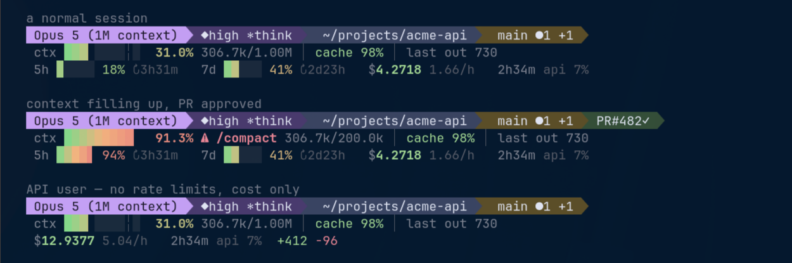

# claude-code-statuslines

Status lines for [Claude Code](https://code.claude.com/docs/en/statusline).

Each directory is a self-contained status line: drop the script somewhere, point
`statusLine.command` at it, done. No runtime dependencies beyond the language
the script is written in.




| Status line | Language | Highlights |
| --- | --- | --- |
| [`opus-dashboard`](opus-dashboard/) | Python 3 (stdlib only) | 3 rows, powerline, gradient bars, rate limits, cache efficiency |
| [`fable-meter`](fable-meter/) | Python 3 (stdlib only) | 2 rows, tuned for Claude Fable 5: live turn timer, per-turn spend, sparkline trends, effort dial |

## Installing any of them

Add a `statusLine` block to `~/.claude/settings.json`:

```json
{
  "statusLine": {
    "type": "command",
    "command": "~/.claude/statusline.py",
    "refreshInterval": 30,
    "hideVimModeIndicator": true
  }
}
```

`refreshInterval` keeps time-based fields (rate-limit reset countdowns) moving
while the session is idle. `hideVimModeIndicator` suppresses Claude Code's own
`-- INSERT --` line for status lines that render the vim mode themselves.

## License

MIT
