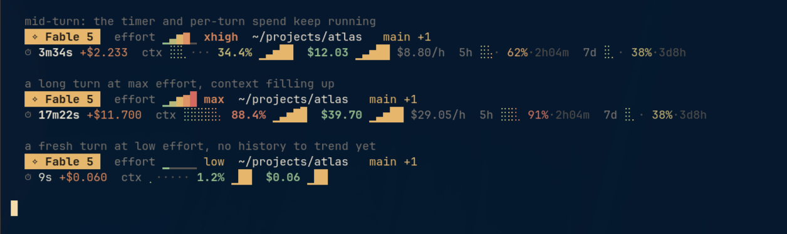

# fable-meter

A status line for [Claude Fable 5](https://code.claude.com/docs/en/statusline).
Python 3, standard library only.



## Why this is different

Fable 5 is not just a bigger model, and a generic dashboard doesn't fit it:

| Fable 5 | What this status line does about it |
| --- | --- |
| $10 / $50 per MTok — twice Opus 5 | spend gets a running trend and a per-turn figure, not a footnote |
| a single turn can run many minutes | a live turn timer, so you can tell working from hung |
| thinking is always on, no way to disable | no "thinking" flag — it would always be true. `effort` gets a dial instead |
| 1M context window | trend matters more than the instantaneous percentage |

The two questions that actually come up while waiting on Fable are *is it still
working* and *what is this costing me*, so those are the two things the second
row leads with.

## The stateful part

Most status lines are pure functions of the JSON on stdin. This one keeps a
small history, because the interesting quantities are rates rather than
instants.

Claude Code re-runs the status line on every assistant message and on a
`refreshInterval` timer, and passes a `prompt_id` that changes once per user
turn. That is enough to derive:

- **turn timer** — when `prompt_id` changes, a turn started; time from there
- **per-turn spend** — `total_cost_usd` now minus its value when the turn began
- **sparklines** — cost and context sampled over the last ~48 invocations

State is one JSON file per session under `$XDG_RUNTIME_DIR`, written
atomically, capped at 48 samples. It is disposable: delete it and the status
line simply starts trending again from the next invocation.

`/clear` resets `total_cost_usd` to zero. The script detects the decrease and
drops its history rather than rendering a negative delta or a false spike.

## Rows

**1 — identity.** Model chip, effort dial (five levels, `low` through `max`),
working directory, git branch with a dirty count, PR number, session name.

**2 — the meter.** Turn timer and per-turn spend, a braille context meter with
a growth sparkline, total spend with a spend sparkline and hourly rate, then
the 5-hour and 7-day rate-limit windows with reset countdowns.

## Install

```bash
mkdir -p ~/.claude
curl -o ~/.claude/fable-meter.py \
  https://raw.githubusercontent.com/sl4ppy/claude-code-statuslines/main/fable-meter/statusline.py
chmod +x ~/.claude/fable-meter.py
```

```json
{
  "statusLine": {
    "type": "command",
    "command": "~/.claude/fable-meter.py",
    "refreshInterval": 5
  }
}
```

A short `refreshInterval` matters more here than for a stateless status line —
it is what makes the turn timer tick and what gives the sparklines their
resolution. Five seconds is a reasonable floor; the script takes about 25 ms
per run. The minimum Claude Code accepts is `1`.

## Configuration

| Variable | Effect |
| --- | --- |
| `NO_COLOR` | any value disables colour |
| `COLORTERM` | `truecolor`/`24bit` enables 24-bit colour, else the 256-colour cube |

Constants at the top of the script control history depth (`MAX_SAMPLES`), the
sparkline and braille ramps, and the palette.

## Requirements

Python 3.8+, a writable `$XDG_RUNTIME_DIR` (falls back to `/tmp`), and a font
with braille and block glyphs — nearly all monospace fonts have both. A Nerd
Font gives you the git branch icon; everything else is plain Unicode.

## Development

```bash
export DEMO_HOME=$(mktemp -d)
mkdir -p "$DEMO_HOME/projects/atlas"
git -C "$DEMO_HOME/projects/atlas" init -q -b main
git -C "$DEMO_HOME/projects/atlas" commit -q --allow-empty -m initial
python3 demo.py
```

`demo.py` seeds state files with plausible histories before rendering, so the
timer and sparklines have something to show — a cold first run would display
neither. It covers a mid-turn session, a long turn at max effort with the
context filling, and a fresh low-effort turn with no history yet.

## License

MIT
